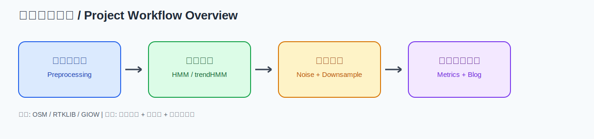

# 基于 HMM 的 GPS 轨迹地图匹配复现与实验分析



本项目围绕经典 `HMM` 地图匹配与加入方向趋势约束的 `trendHMM` 展开复现，覆盖模拟轨迹、RTKLIB 动态轨迹和 GIOW 公开数据三类输入，并提供统一的实验与评价脚本。

项目博客展示页：`docs/index.html`（适配 GitHub Pages）。

## 目录结构

- `data/raw/`：原始数据（OSM、RTKLIB、GIOW）。
- `data/processed/`：预处理后的 CSV 输入数据。
- `src/preprocessing/`：数据解析与格式整理脚本。
- `src/simulation/`：模拟轨迹和噪声数据生成脚本。
- `src/map_matching/`：地图匹配主程序。
- `src/experiments/`：批量实验入口（噪声组 + 降采样组）。
- `src/evaluation/`：评价指标统计脚本。
- `src/visualization/`：生成网页可视化图片的脚本。
- `experiments/giow_track_subset/`：GIOW 全时段降采样实验数据与结果。
- `experiments/kinematic/`：RTKLIB 动态轨迹实验数据与结果。
- `docs/`：博客页面与参考文献 PDF。
- `video_private/`：视频制作相关文件（私有，不开源）。

## 数据说明

主要可直接复现实验的处理后数据：

- `data/processed/gps_giow_match.csv`
- `data/processed/gps_giow_window_0s_to_5000s_dt_1p0s.csv`
- `data/processed/gps_kinematic_match.csv`
- `data/processed/gps_points.csv`

默认不随仓库分发的大文件：

- `data/raw/giow/reference_result.nav`
- `data/processed/gps_giow_raw.csv`

## 依赖环境

建议 Python 3.10+。

- 核心依赖安装：`pip install -r requirements-core.txt`
- 可视化依赖安装：`pip install -r requirements-viz.txt`
- 全量安装：`pip install -r requirements.txt`

## 典型运行顺序

1. 预处理原始数据

```bash
python3 src/preprocessing/convert_pos_to_csv.py
python3 src/preprocessing/make_match_csv.py
python3 src/preprocessing/convert_giow_nav_to_csv.py
python3 src/preprocessing/prepare_giow_subset.py --window-seconds 5000 --time-step-seconds 1.0
```

2. 生成模拟轨迹

```bash
python3 src/simulation/generate_gps.py
python3 src/simulation/add_gaussian_noise.py --input data/processed/gps_points.csv --output data/processed/gps_points_noise10.csv --sigma-m 10
```

3. 单次地图匹配（示例）

```bash
python3 src/map_matching/hmm_map_matching_local_pbf.py
```

4. 批量实验与评估

```bash
python3 -m src.experiments.run_followup_experiments --dataset giow_track_subset
python3 src/evaluation/evaluate_new_metrics.py --dataset giow_track_subset
python3 -m src.experiments.run_followup_experiments --dataset kinematic
python3 src/evaluation/evaluate_new_metrics_kinematic.py
```

## 开源与私有边界

- `.vscode/` 与 `video_private/` 已在 `.gitignore` 中排除。
- 视频成片、字幕、音频及剪辑脚本统一存放于 `video_private/`，不作为开源内容。
- 代码、实验结果与论文资料目录（`docs/papers/`）保留用于开源复现。
- 发布检查记录见 `RELEASE_CHECKLIST.md`。

---

# HMM-based GPS Trajectory Map-Matching Reproduction and Experiment Analysis


This project reproduces the classic `HMM` map-matching pipeline and an enhanced `trendHMM` version with direction-trend constraints. It covers three input types (simulated tracks, RTKLIB kinematic tracks, and GIOW public data) and provides a unified experiment and evaluation workflow.

Project blog page: `docs/index.html` (GitHub Pages ready).

## Project Structure

- `data/raw/`: raw datasets (OSM, RTKLIB, GIOW).
- `data/processed/`: processed CSV inputs.
- `src/preprocessing/`: scripts for parsing and formatting raw data.
- `src/simulation/`: scripts for simulated tracks and noise generation.
- `src/map_matching/`: core map-matching implementation.
- `src/experiments/`: batch experiment entry (noise + downsampling groups).
- `src/evaluation/`: metric calculation scripts.
- `src/visualization/`: scripts for blog-ready visualization images.
- `experiments/giow_track_subset/`: GIOW full-window downsampled experiment data/results.
- `experiments/kinematic/`: RTKLIB kinematic experiment data/results.
- `docs/`: blog page and paper PDFs.
- `video_private/`: video-production assets (private, not open-source).

## Data Notes

Main processed files for direct reproduction:

- `data/processed/gps_giow_match.csv`
- `data/processed/gps_giow_window_0s_to_5000s_dt_1p0s.csv`
- `data/processed/gps_kinematic_match.csv`
- `data/processed/gps_points.csv`

Large files excluded from public distribution by default:

- `data/raw/giow/reference_result.nav`
- `data/processed/gps_giow_raw.csv`

## Dependencies

Recommended Python version: 3.10+.

- Core install: `pip install -r requirements-core.txt`
- Visualization install: `pip install -r requirements-viz.txt`
- Full install: `pip install -r requirements.txt`

## Typical Run Order

1. Preprocess raw data

```bash
python3 src/preprocessing/convert_pos_to_csv.py
python3 src/preprocessing/make_match_csv.py
python3 src/preprocessing/convert_giow_nav_to_csv.py
python3 src/preprocessing/prepare_giow_subset.py --window-seconds 5000 --time-step-seconds 1.0
```

2. Generate simulated tracks

```bash
python3 src/simulation/generate_gps.py
python3 src/simulation/add_gaussian_noise.py --input data/processed/gps_points.csv --output data/processed/gps_points_noise10.csv --sigma-m 10
```

3. Single-run map matching (example)

```bash
python3 src/map_matching/hmm_map_matching_local_pbf.py
```

4. Batch experiments and evaluation

```bash
python3 -m src.experiments.run_followup_experiments --dataset giow_track_subset
python3 src/evaluation/evaluate_new_metrics.py --dataset giow_track_subset
python3 -m src.experiments.run_followup_experiments --dataset kinematic
python3 src/evaluation/evaluate_new_metrics_kinematic.py
```

## Open-source vs Private Scope

- `.vscode/` and `video_private/` are excluded in `.gitignore`.
- Final videos, subtitles, audio, and editing scripts are under `video_private/` and are not open-source.
- Code, experiment outputs, and paper materials (`docs/papers/`) remain for reproducibility.
- Release audit notes are in `RELEASE_CHECKLIST.md`.
